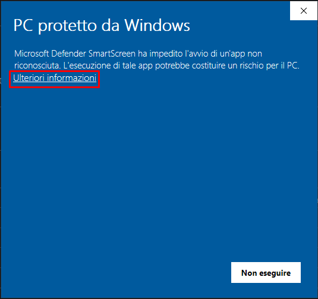
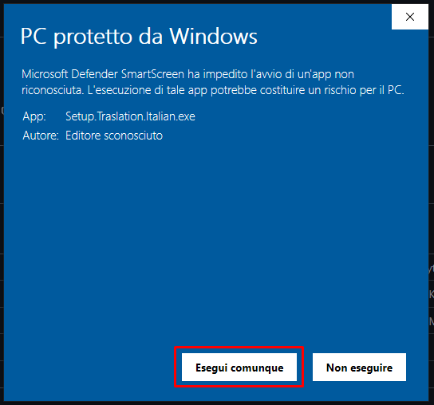

# Traduzione in Italiano per Star Citizen

   
   
   

### Questa è una traduzione pubblica fatta da MrRevo, GattoMatto e dall'org LSE per la community di Star Citizen

## Indice
- [Instalazione](#instalazione)
- [Uninstalla](#uninstalla)
- [Aggiornamento manuale](#aggiorna)

 

# Instalazione

**ATTENZIONE**: Usare solo uno dei due metodi

#### Instalazione Setup (Consigliata)

1. Scaricare l' installer `AUTO Installer traduzione SC` dal seguente [link](https://github.com/MrRevotv/StarCitizenItaLauncher/releases/download/Ita_V2.0/StarCitizenItaLauncher.exe);
2. Se appare dare conferma di download sicuro sul proprio browser;
3. Cliccare per eseguire installazione
   AVVISO: Windows potrebbe mostrare un messaggio che il file non è sicuro perchè non riesce a verificare la firma digitale **L' installer è sicuro**;
   Per ovviare al problema basta cliccare su `Ulteriori Informazioni` e poi su `Esegui Cominque`;
   
   
   

5. Installare la traduzione nella versione desiderata (LIVE,PTU,ecc.)

#### Instalazione Manuale

1. Scaricare il File `global.ini` dal seguente [link](https://drive.google.com/drive/folders/1UzxOam6DyUeSjamVqYgm7Z1KexSkH7dr?usp=sharing);
2. Aprire la cartella di installazione di Star-Citizen es: `C:\Program Files\Roberts Space Industries\StarCitizen\LIVE`;
3. Aprire il file zip e trascinare la cartella `data` dentro la cartella installazione di Star-Citizen aperta in precedenza;
4. Trascinare anche il file user.cfg nella cartella di installazione di Star-Citizen aperta in precedenza;
6. Installzione completata.

# Uninstalla

#### Metodo tramite Setup
1.Dopo aver avviato l'installer cliccare sul tasto "RIMUOVI" o sul tasto "RIPRISTINA UFFICIALE" se si è scelto in precedenza di installare un file custom tramite installer;

#### Metodo Manuale

1. Aprire la cartella di installazione di Star-Citizen es: `C:\Program Files\Roberts Space Industries\StarCitizen\LIVE`;
2. Eliminare il file user.cfg;
3. Aprire la cartella `data` cercare la cartella `Localization` ed eliminarla;

